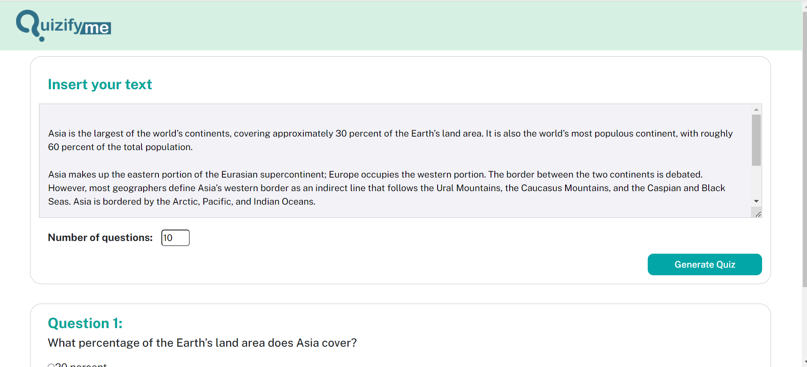

# QuizifyMe


QuizifyMe is an innovative and interactive learning application designed to make studying more engaging and efficient. With QuizifyMe, you can transform your study sessions into captivating quizzes that foster a deeper understanding of the subject matter.

## Features

- **Question Generation**: QuizifyMe utilizes state-of-the-art models to generate thought-provoking questions based on your input. Whether you provide a customized text or extract content from a Wikipedia URL, QuizifyMe leverages the power of open-source models to create engaging questions.

- **Multiple-Choice Options**: In addition to generating questions, QuizifyMe also generates multiple-choice options for each question. This ensures that you not only answer the questions but also have the opportunity to evaluate different possibilities, enhancing your critical thinking skills.

- **Adaptive Learning**: QuizifyMe adapts to your learning needs and preferences. The application intelligently selects questions and adjusts the difficulty level based on your progress, ensuring an optimal learning experience tailored to your unique requirements.

- **User-Friendly Interface**: QuizifyMe features a user-friendly interface that makes it easy to navigate and interact with the application. The intuitive design enables seamless access to quizzes, performance tracking, and personalized study recommendations.

## How It Works

1. **Input**: You can input your own customized text or provide a Wikipedia URL from which QuizifyMe extracts relevant content for generating questions.

2. **Question Generation**: QuizifyMe employs open-source models to analyze the input and generate high-quality questions that test your knowledge and understanding of the topic.

3. **Multiple-Choice Options**: To ensure a comprehensive learning experience, QuizifyMe generates multiple-choice options for each question. This allows you to consider various possibilities and select the most appropriate answer.

4. **Interactive Quizzing**: Engage in interactive quizzes where you answer the generated questions and select the correct option from the multiple-choice answers. QuizifyMe provides instant feedback on your answers, allowing you to track your progress and identify areas for improvement.

5. **Adaptive Learning**: QuizifyMe adapts to your performance and adjusts the difficulty level of the questions accordingly. This adaptive learning approach ensures that you are consistently challenged and motivated to enhance your knowledge.

## Get Started
1. Open a command prompt or terminal window.
2. Navigate to the directory.
3. Once you are in the correct directory, run the following command to install the requirements:
   ```
   pip install -r requirements.txt
   ```
4. Download model weights by running `model_installation.py`.

## Usage
- To test the model, use `test.ipynb`.
- To run the whole application, execute `app.py`.

## Model 
We used two open-source models available on Hugging Face:

- Question Answer Generation: [potsawee/t5-large-generation-squad-QuestionAnswer](https://huggingface.co/potsawee/t5-large-generation-squad-QuestionAnswer)
- Distractor Generation: [potsawee/t5-large-generation-race-Distractor](https://huggingface.co/potsawee/t5-large-generation-race-Distractor)

## Dataset Overview
- Question-Answer Generation utilized the [SQUAD dataset](https://huggingface.co/datasets/squad/viewer/plain_text/train?row=0). It consists of short paragraphs (contexts), questions, and answers.

  Example:
  ```
  Context: "Architecturally, the school has a Catholic character. Atop the Main Building's gold dome is a golden statue of the Virgin Mary. Immediately in front of the Main Building and facing it, is a copper statue of Christ with arms upraised..."
  Question: "To whom did the Virgin Mary allegedly appear in 1858 in Lourdes France?"
  Answer: "Saint Bernadette Soubirous"
  ```

- Multiple Choices Generation utilized the [RACE dataset](https://huggingface.co/datasets/race). It contains contexts (paragraphs), four answers, a correct answer, and the text used to generate the question.

  Example:
  ```
  Article: "The rain had continued for a week and the flood had created a big river which was running by Nancy Brown's farm..."
  Answer: "C"
  Question: "What did Nancy try to do before she fell over?"
  Options: [ "Measure the depth of the river", "Look for a fallen tree trunk", "Protect her cows from being drowned", "Run away from the flooded farm" ]
  ```

## Contact

If you have any questions or feedback, feel free to reach out to us:

- Email: [williamhuybui@gmail.com](mailto:williamhuybui@gmail.com)
