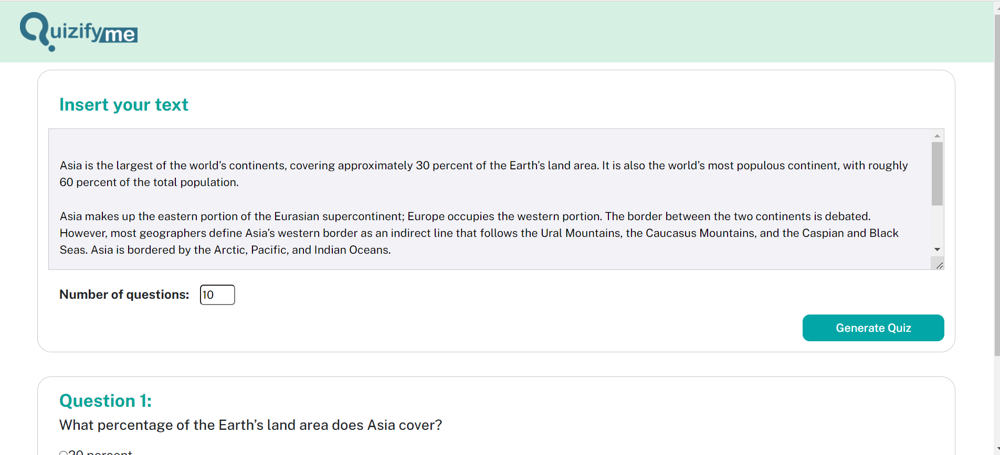
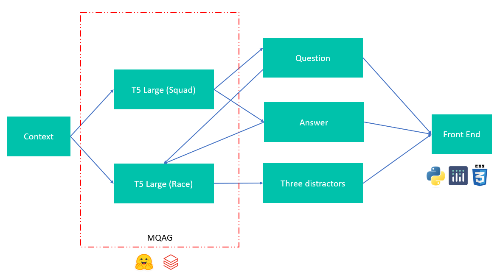

# [QuizifyMe](https://quizifyme.herokuapp.com/)


QuizifyMe is an innovative and interactive learning application designed to make studying more engaging and efficient. With QuizifyMe, you can transform your study sessions into captivating quizzes that foster a deeper understanding of the subject matter.

## Video Demo


## Get Started
1. Open a command prompt or terminal window.
2. Navigate to the directory.
3. Once you are in the correct directory, run the following command to install the requirements:
   ```
   pip install -r requirements.txt
   ```
4. Download model weights by running `model_installation.py`. The file is quite large (5.5 gb), but once downloaded you can run the jupyter notebook to test or run the entire app (Instruction below). After download if folder will look like this:
```
models
+ g1_model
-- config
-- pytorch_model.bin
+ g1_tokenizer
-- special_tokens_map
-- tokenizer
-- tokenizer_config
+ g2_model
-- config
-- pytorch_model.bin
+ g2_tokenizer
-- special_tokens_map
-- tokenizer
-- tokenizer_config
```

## Usage
- To test the model, use `test.ipynb`.
- To run the whole application, execute `app.py`.
- To check out the deployed app, go here: https://quizifyme.herokuapp.com/
  
## Model and Dataset
We used two open-source models available on Hugging Face:

- Question Answer Generation: [potsawee/t5-large-generation-squad-QuestionAnswer](https://huggingface.co/potsawee/t5-large-generation-squad-QuestionAnswer)
- Distractor Generation: [potsawee/t5-large-generation-race-Distractor](https://huggingface.co/potsawee/t5-large-generation-race-Distractor)

The following chart shows the architecture of the app:


- Question-Answer Generation utilized the [SQUAD dataset](https://huggingface.co/datasets/squad/viewer/plain_text/train?row=0). It consists of short paragraphs (contexts), questions, and answers.

  Example:
  ```
  Context: "Architecturally, the school has a Catholic character. Atop the Main Building's gold dome is a golden statue of the Virgin Mary. Immediately in front of the Main Building and facing it, is a copper statue of Christ with arms upraised..."
  Question: "To whom did the Virgin Mary allegedly appear in 1858 in Lourdes France?"
  Answer: "Saint Bernadette Soubirous"
  ```

- Multiple Choices Generation utilized the [RACE dataset](https://huggingface.co/datasets/race). It contains contexts (paragraphs), four answers, a correct answer, and the text used to generate the question.

  Example:
  ```
  Article: "The rain had continued for a week and the flood had created a big river which was running by Nancy Brown's farm..."
  Answer: "C"
  Question: "What did Nancy try to do before she fell over?"
  Options: [ "Measure the depth of the river", "Look for a fallen tree trunk", "Protect her cows from being drowned", "Run away from the flooded farm" ]
  ```

## Contact

If you have any questions or feedback, feel free to reach out to us:

- Email: [williamhuybui@gmail.com](mailto:williamhuybui@gmail.com)
